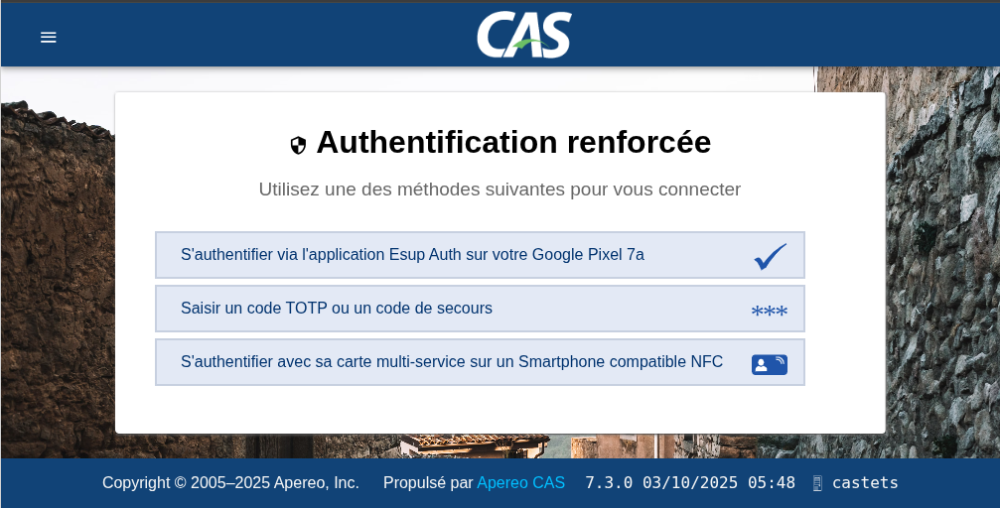
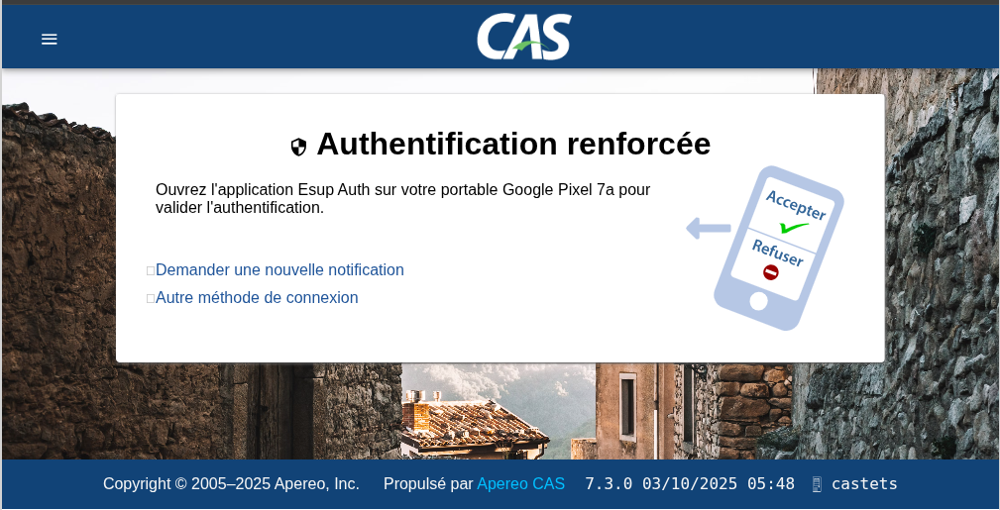

Works on Apereo CAS V 7.3.0 - https://github.com/apereo/cas

Require [esup-otp-api](https://github.com/EsupPortail/esup-otp-api/) $\ge$ v2.1.0

## Config

### cas.properties

add the following:

```
# MFA Esup Otp Authentication
cas.authn.mfa.triggers.global.global-provider-id=mfa-esupotp

# Add translations, you will need to check what are the default from CAS "Message Bundles" properties
cas.messageBundle.baseNames=classpath:custom_messages,classpath:messages,classpath:esupotp_message

# Add your esup-otp-api in Content-Security-Policy:
cas.http-web-request.header.content-security-policy=script-src 'self' 'unsafe-inline' 'unsafe-eval' https://esup-otp-api.univ-ville.fr/; object-src 'none'; worker-src 'self' blob: 'unsafe-inline' 
```
If you want to trust devices for 7 days, you can add this in cas.properties
```
cas.authn.mfa.trusted.core.device-registration-enabled=true                                                                                                                                         
cas.authn.mfa.trusted.core.auto-assign-device-name=true
cas.authn.mfa.trusted.device-fingerprint.cookie.max-age=604800
```
with auto-assign-device-name, user will not have to choose a name for his device in a web form, it will be automatically assigned.  

### esupotp.properties

Create esupotp.properties in same directory as cas.properties
```
##
# Esup Otp Authentication
#
esupotp.rank=0
esupotp.urlApi=http://my-api.com:8081
esupotp.usersSecret=changeit
esupotp.apiPassword=changeit
esupotp.byPassIfNoEsupOtpMethodIsActive=false
esupotp.otpManagerUrl=https://esup-otp-manager.univ.fr/
esupotp.failureMode=CLOSED
```

In esupotp.properties you can also use usual Multifactor Authentication Bypass configurations described here https://apereo.github.io/cas/7.3.x/mfa/Configuring-Multifactor-Authentication-Bypass.html

So for example you can setup bypass with groovy script :
```
esupotp.bypass.groovy.location=file:/etc/cas/config/mfaGroovyBypass.groovy
```

/etc/cas/config/mfaGroovyBypass.groovy :
``` groovy
import java.util.*

def boolean run(authentication, principal, registeredService, provider, logger, httpRequest, ... other_args) {

    if(registeredService.id == 10 && "cn=for.appli-sensible.supervisor,ou=groups,dc=univ-ville,dc=fr" in principal.attributes.memberOf) {
      return true;
    }

    return false;
}
```

### cas/build.gradle

add
``` groovy
...

dependencies {
    ...
    implementation "org.esup-portail:esup-otp-cas:v2.1.0-cas_v7.3.x"
}
```

### log4j2.xml

add
```
<AsyncLogger name="org.esupportail.cas.adaptors.esupotp" level="debug" additivity="false" includeLocation="true">
    <AppenderRef ref="casConsole"/>
    <AppenderRef ref="casFile"/>
</AsyncLogger>
```

If you want to use an untagged version, you can use jitpack.io :

Add in cas/build.gradle
``` groovy
...
repositories {
    ...
    maven {
        url "https://jitpack.io"
    }
}
...

dependencies {
    ...
    implementation "com.github.EsupPortail:esup-otp-cas:master"
}
```

TIPS: Look for https://jitpack.io/#EsupPortail/esup-otp-cas and check the available version you can use


If you want to package locally, with JDK 21 :
```
./gradlew clean build
```

## publishing on central maven repository

This part is only for developers, if you want to publish on central maven repository, you need to have a sonatype account and be a member of the group org.esup-portail. 

esup-otp-cas use jrelease plugin to publish on maven central repository.

You have to configure also your ~/.jreleaser/config.yml file with your sonatype credentials.

See https://jreleaser.org/guide/latest/examples/maven/maven-central.html#_gradle

Next, to publish on central maven repository, with JDK 21, and after setting version on gradle.properties :
```
./gradlew clean build publish jreleaserFullRelease
```


## Screenshots





